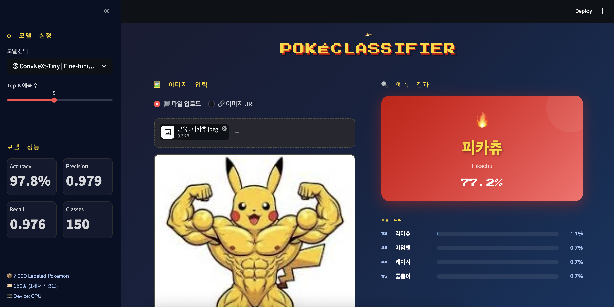
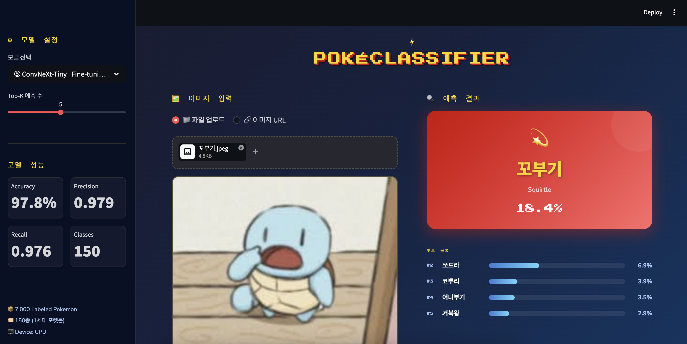
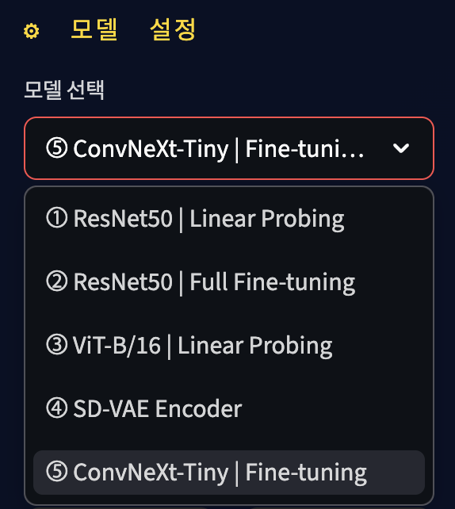
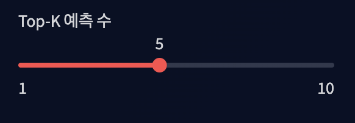
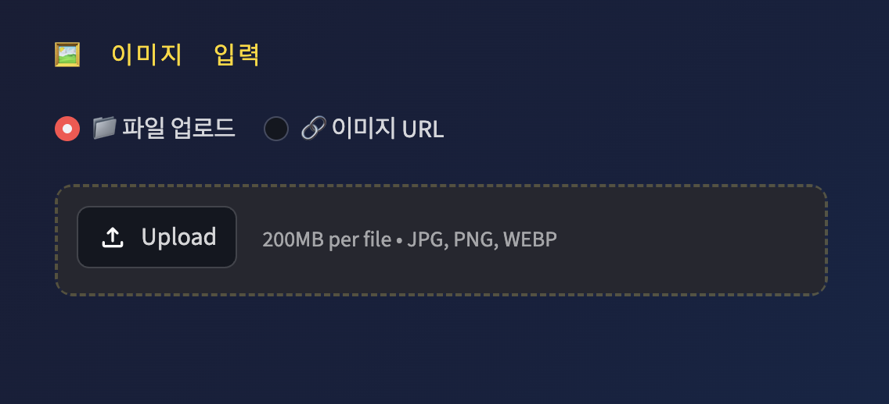
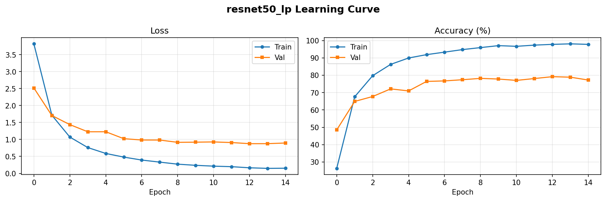
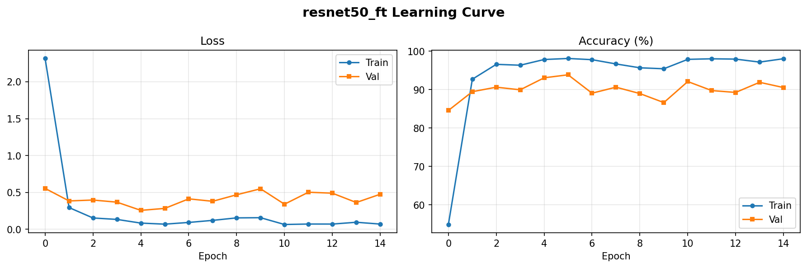
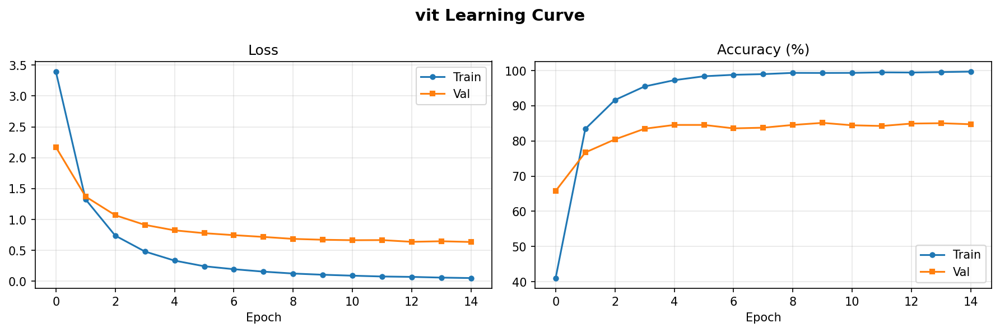
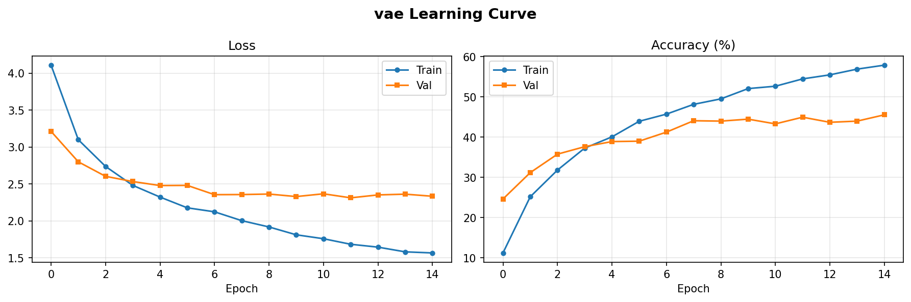
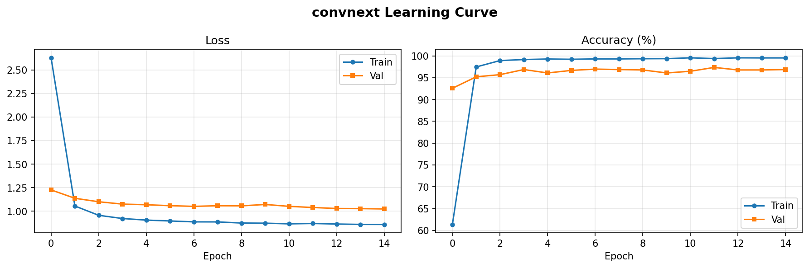

# ⚡ PokéClassifier

**A Pokémon image classifier using Transfer Learning**  
Classifies 150 Generation 1 Pokémon through 5 different Transfer Learning strategies, predicting Pokémon names in Korean.

<br>

## 🎮 Demo




Upload an image or paste a URL to predict the Pokémon's Korean name and confidence score.

```bash
streamlit run app.py
```

<br>

## 🕹️ Features

| Sidebar — Model Selection & Metrics | Top-K Adjustment | Image Upload |
|:---:|:---:|:---:|
|  |  |  |

<br>

## 🏆 Experiment Results

| Exp | Model | Strategy | Test Accuracy (Top-1) | Precision | Recall |
|:---:|:---:|:---:|:---:|:---:|:---:|
| Exp 1 | ResNet50 | Linear Probing | 79.37% | 0.8236 | 0.7911 |
| Exp 2 | ResNet50 | Full Fine-tuning | 92.67% | 0.9287 | 0.9282 |
| Exp 3 | ViT-B/16 | Linear Probing | 84.85% | 0.8617 | 0.8479 |
| Exp 4 | SD-VAE Encoder | Linear Probing | 49.66% | 0.4982 | 0.4971 |
| **Exp 5** | **ConvNeXt-Tiny** | **Full Fine-tuning** | **97.75%** | **0.9789** | **0.9757** |

**Winner: ConvNeXt-Tiny (97.75%)** 🥇

<br>

## 🔬 Experiment Design & Analysis

### Why these 5 models?

Each experiment isolates a single variable for a fair comparison.

```
Exp1 vs Exp2    →  Effect of fine-tuning scope    (frozen backbone vs full training)
Exp1 vs Exp3    →  Effect of architecture          (CNN vs Transformer)
Exp1~3 vs Exp4  →  Effect of pretraining task     (classification vs generation)
Exp2 vs Exp5    →  Effect of modern CNN design     (ResNet vs ConvNeXt)
```

---

### Exp 1 — ResNet50 Linear Probing (Baseline)

**Test Accuracy: 79.37%**

The backbone of an ImageNet-pretrained ResNet50 is fully frozen, and only the final FC layer (307,350 parameters — just 1.3% of the total 23.8M) is trained.

A critical implementation detail is **BatchNorm freeze**. Even when the backbone is frozen, calling `model.train()` puts BN layers into training mode, which corrupts the pretrained running statistics and prevents convergence. Forcing BN to stay in eval mode preserves the backbone's pretrained representations.

---

### Exp 2 — ResNet50 Full Fine-tuning

**Test Accuracy: 92.67%**

The same ResNet50 architecture, but **all parameters are trained**. A **layer-wise learning rate** strategy is applied: backbone uses lr=1e-4 to slowly adapt while preserving pretrained knowledge, and the head uses lr=1e-3 for faster convergence.

**+13.3%p improvement** over Exp 1. Full fine-tuning of the backbone to the Pokémon domain is overwhelmingly more effective than linear probing alone.

---

### Exp 3 — ViT-B/16 Linear Probing

**Test Accuracy: 84.85%**

Uses a **Vision Transformer** instead of CNN. The image is split into 196 patches of 16×16, and global relationships are learned via Self-Attention. Despite having a much larger total parameter count (85.9M vs 23.8M), trainable parameters under linear probing are actually fewer (115K vs 307K).

**+5.5%p improvement** over Exp 1. The higher performance with fewer trainable parameters shows that ViT's pretrained representations naturally capture global Pokémon features (color, silhouette, shape). ViT also uses LayerNorm instead of BatchNorm, so no BN freeze is required.

---

### Exp 4 — Stable Diffusion VAE Encoder

**Test Accuracy: 49.66%**

This experiment started from a simple curiosity: *"Models like Stable Diffusion can generate incredibly detailed images — that means their encoders must understand visual structure deeply. What if we repurpose that encoder as a feature extractor for classification?"*

The result was 49.66%, the lowest among all experiments. The core issue is that a VAE encoder is optimized to reconstruct images faithfully, not to separate classes. Its latent space is organized around visual similarity (texture, color, shape), not semantic identity. A Pikachu and a Raichu may look similar enough to land near each other in latent space, making classification difficult.

Additionally, the SD-VAE was pretrained on real photographs (LAION-5B), creating a domain gap with cartoon-style Pokémon images. Still, reaching 49.66% — 75× above random chance (0.67%) — suggests that even a generation-focused encoder captures enough visual structure to be partially useful for classification.

---

### Exp 5 — ConvNeXt-Tiny Full Fine-tuning

**Test Accuracy: 97.75%** 🏆

ConvNeXt was designed by asking: *"What if we apply Transformer design principles to a pure CNN?"* It incorporates depthwise convolution (replacing self-attention), LayerNorm (replacing BatchNorm), GELU activation, and larger 7×7 kernels.

Two key factors drove **+5.08%p improvement** over ResNet FT:

- **AdamW + weight decay** for stronger regularization
- **Label Smoothing (0.1)** to prevent overconfidence, eliminating the Val Loss oscillation seen in Exp 2 after Epoch 6

```
Epoch 1:  Val 92.57% → Surpasses ResNet FT's final result in a single epoch
Epoch 12: Val 97.36% → Stable convergence with no oscillation
```

<br>

## 📈 Learning Curves

| Exp 1 — ResNet50 LP | Exp 2 — ResNet50 FT |
|:---:|:---:|
|  |  |

| Exp 3 — ViT-B/16 LP | Exp 4 — SD-VAE |
|:---:|:---:|
|  |  |

| Exp 5 — ConvNeXt-Tiny FT |
|:---:|
|  |

<br>

## ⚠️ Limitations

- **Small dataset**: With only ~45 images per class, all models are prone to overfitting. Train accuracy reached 99% while Val accuracy plateaued around 85~97%, indicating a clear generalization gap.

- **Val Loss oscillation in ResNet FT**: Without a learning rate scheduler, the model overshoots the optimum after Epoch 6, causing unstable validation performance.

- **VAE Encoder as a classifier — an exploratory experiment**: The VAE experiment started from a simple curiosity: *"Models like Stable Diffusion can generate incredibly detailed images — that means their encoders must understand visual structure deeply. What if we repurpose that encoder as a feature extractor for classification?"*
  The result was 49.66%, the lowest among all experiments. The core issue is that a VAE encoder is optimized to reconstruct images faithfully, not to separate classes. Its latent space is organized around visual similarity (texture, color, shape), not semantic identity. A Pikachu and a Raichu may look similar enough to land near each other in latent space, making classification difficult. Additionally, the SD-VAE was pretrained on real photographs (LAION-5B), creating a domain gap with cartoon-style Pokémon images.

<br>

## 📁 Dataset

- **Source**: [7,000 Labeled Pokemon](https://www.kaggle.com/datasets/lantian773030/pokemonclassification) by Lance Zhang (Kaggle)
- **Classes**: 150 (all Generation 1 Pokémon)
- **Total images**: 6,837 (hand-cropped, Pokémon centered)
- **Average per class**: 45.6 images
- **Split**: Train 70% / Val 15% / Test 15%

<br>

## 📂 Project Structure

```
pokemon-classifier/
├── images/                  ← Screenshots & learning curves
├── results/
│   ├── convNext/            ← Exp 5: ConvNeXt-Tiny
│   │   └── convNext.py
│   ├── resnet50_ft/         ← Exp 2: ResNet50 Full Fine-tuning
│   │   └── resnet50_ft.py
│   ├── resnet50_lp/         ← Exp 1: ResNet50 Linear Probing
│   │   └── resnet50_lp.py
│   ├── vae/                 ← Exp 4: SD-VAE Encoder
│   │   └── vae.py
│   └── vit/                 ← Exp 3: ViT-B/16
│       └── vit.py
├── app.py                   ← Streamlit demo
├── dataloader.py            ← Dataset loader & augmentation
├── utils.py                 ← Shared training utilities
├── korean_names.py          ← English → Korean name mapping
├── requirements.txt
└── .gitignore
```

<br>

## 🚀 Getting Started

### Install dependencies

```bash
pip install -r requirements.txt
```

### Train individual experiments

```bash
python results/resnet50_lp/resnet50_lp.py   # Exp 1
python results/resnet50_ft/resnet50_ft.py   # Exp 2
python results/vit/vit.py                   # Exp 3
python results/vae/vae.py                   # Exp 4 (requires diffusers)
python results/convNext/convNext.py         # Exp 5
```

### Run the demo

```bash
streamlit run app.py
# Open http://localhost:8501
```

<br>

## 🏗️ Model Specification

| | ResNet50 LP | ResNet50 FT | ViT-B/16 LP | SD-VAE | ConvNeXt-Tiny FT |
|:---:|:---:|:---:|:---:|:---:|:---:|
| Total params | 23.8M | 23.8M | 85.9M | 34.4M | 28.6M |
| Trainable params | 307K | 23.8M | 115K | 279K | 28.6M |
| Backbone | ResNet50 | ResNet50 | ViT-B/16 | SD-VAE | ConvNeXt-Tiny |
| Pretrained on | ImageNet | ImageNet | ImageNet | LAION-5B | ImageNet |
| BN Freeze | ✅ | ❌ | N/A | N/A | N/A |
| Optimizer | Adam | Adam | Adam | Adam | AdamW |
| Label Smoothing | ❌ | ❌ | ❌ | ❌ | ✅ (0.1) |

<br>

## 🖥️ Training Environment

| | Spec |
|:---:|:---:|
| Platform | Google Colab |
| GPU | NVIDIA T4 |
| CUDA | 12.x |
| Epochs | 15 (all experiments) |
| Training time | Exp 1~3: ~15 min / Exp 4: ~30 min / Exp 5: ~20 min |

<br>

## 📦 Requirements

```
torch>=2.0.0
torchvision>=0.15.0
diffusers>=0.20.0
accelerate
streamlit
scikit-learn
matplotlib
numpy
Pillow
requests
pandas
```